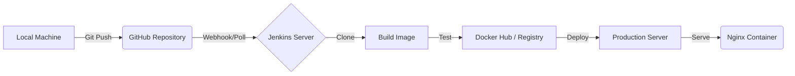

# 🚀 Jenkins CI/CD Pipeline Project

[](https://www.jenkins.io/)
[](https://www.docker.com/)
[](https://nginx.org/)

This project demonstrates a fully automated **Continuous Integration and Continuous Deployment (CI/CD)** pipeline for a static web application. It leverages Jenkins to automate the lifecycle of the application, from code commit to containerized deployment.

## 📋 Table of Contents
- [Project Overview](#-project-overview)
- [Architecture](#-architecture)
- [Tech Stack](#-tech-stack)
- [Pipeline Stages](#-pipeline-stages)
- [Getting Started](#-getting-started)
- [Deployment](#-deployment)
- [Security Note](#-security-note)

---

## 🌟 Project Overview
The goal of this project is to showcase how a simple static website (HTML/CSS/JS) can be built, containerized using Docker, and deployed via a Jenkins Pipeline. The application is served using an Nginx web server inside an Alpine Linux container for maximum efficiency.

## 🏗 Architecture


## 🛠 Tech Stack
- **Frontend**: HTML5, CSS3, JavaScript
- **CI/CD Tool**: Jenkins
- **Containerization**: Docker
- **Web Server**: Nginx (Alpine)
- **Infrastructure**: AWS EC2 (Suggested by `.pem` file)

## 🔄 Pipeline Stages
The `Jenkinsfile` defines a multi-stage pipeline:
1. **Clone Repository**: Pulls the latest code from the `main` branch.
2. **Build**: Prepares the environment for building the application.
3. **Test**: Runs automated tests (Placeholder).
4. **Deploy**: Deploys the application to the target environment.

## 🚀 Getting Started

### Prerequisites
- [Jenkins](https://www.jenkins.io/download/) installed and running.
- [Docker](https://docs.docker.com/get-docker/) installed on the Jenkins agent.
- A GitHub repository with this code.

### Local Run
To test the Docker container locally:
```bash
docker build -t jenkins-cicd-app .
docker run -d -p 8080:80 jenkins-cicd-app
```
Then visit `http://localhost:8080` in your browser.

## 📦 Deployment
The pipeline is designed to be triggered automatically on every push to the repository. 

### Jenkins Configuration
1. Create a new **Pipeline** job in Jenkins.
2. Under **Pipeline**, select **Pipeline script from SCM**.
3. Set SCM to **Git** and provide your repository URL.
4. Ensure the script path is set to `Jenkinsfile`.

## ⚠️ Security Note
> [!CAUTION]
> The repository currently contains a `.pem` file (`Jenkins-CICD-Jenkins.pem`). 
> **Never commit private keys to version control.** 
> It is highly recommended to add this file to your `.gitignore` and manage it using Jenkins Credentials or AWS Secrets Manager.

---

Built with ❤️ by [Shivang Chaurasia](https://github.com/ShivangChaurasia)
